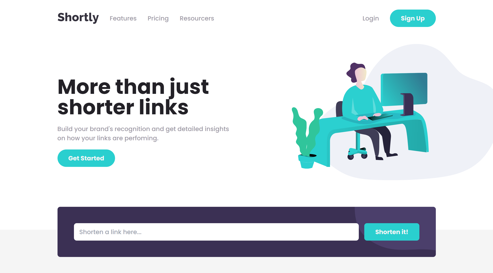

# Frontend Mentor - Shortly URL shortening API Challenge solution

This is a solution to the [Shortly URL shortening API Challenge challenge on Frontend Mentor](https://www.frontendmentor.io/challenges/url-shortening-api-landing-page-2ce3ob-G). Frontend Mentor challenges help you improve your coding skills by building realistic projects.

## Overview

### The challenge

Users should be able to:

- View the optimal layout for the site depending on their device's screen size
- Shorten any valid URL
- See a list of their shortened links, even after refreshing the browser
- Copy the shortened link to their clipboard in a single click
- Receive an error message when the `form` is submitted if:
  - The `input` field is empty

### If you want to run locally

```
Clone the repo and run npm install

Setup a local database with postgres and name it url-shortener

Run the following commands:
- npx prisma init

Edit the .env file with your database info (should look like .env.example). Then run:
- npx prisma generate
- npx prisma migrate dev --name init
- npx prisma db push
```

### Screenshot



### Links

- Live site URL: [Link](https://url-shortener-five-eta.vercel.app/)

### Built with

- [Next.js](https://nextjs.org/) - React framework
- [Tailwind](https://tailwindcss.com/) - For styles
- [Prisma](https://www.prisma.io/)

## Author

- LinkedIn - [Emiliano Acerbi](https://www.linkedin.com/in/emiliano-acerbi)
